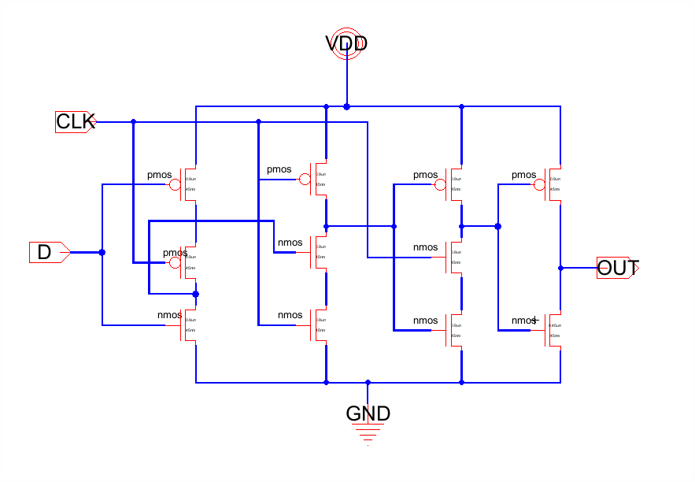
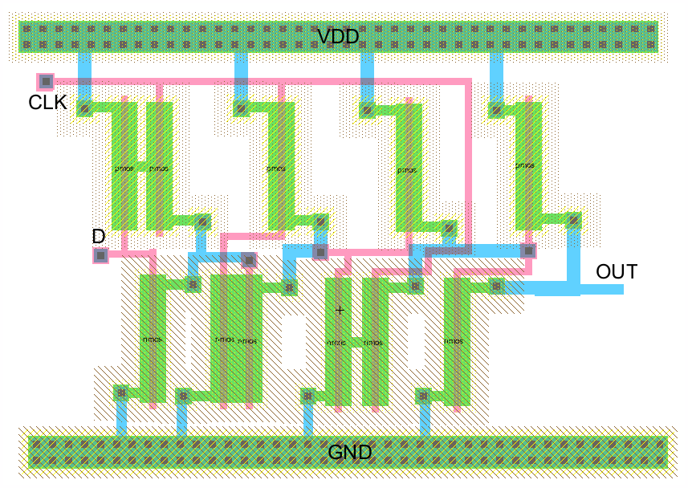
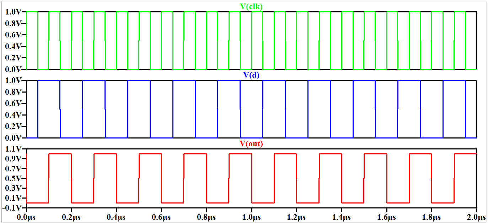
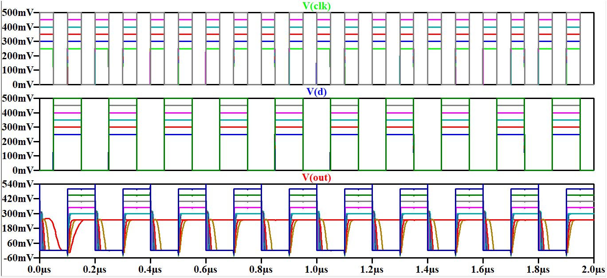
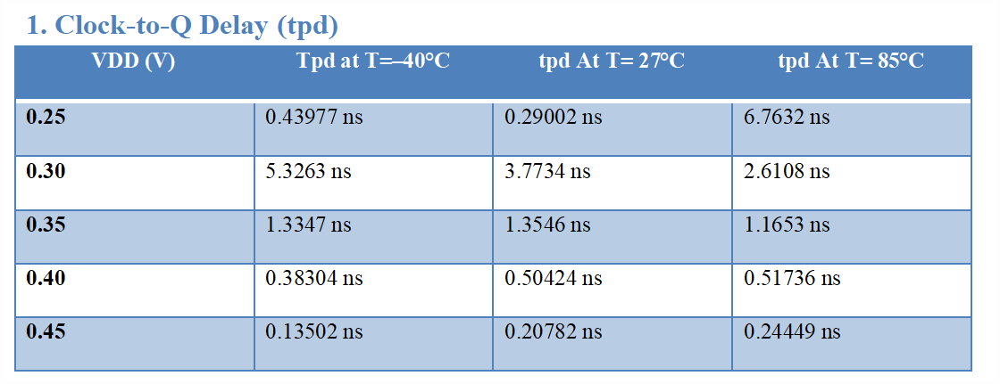
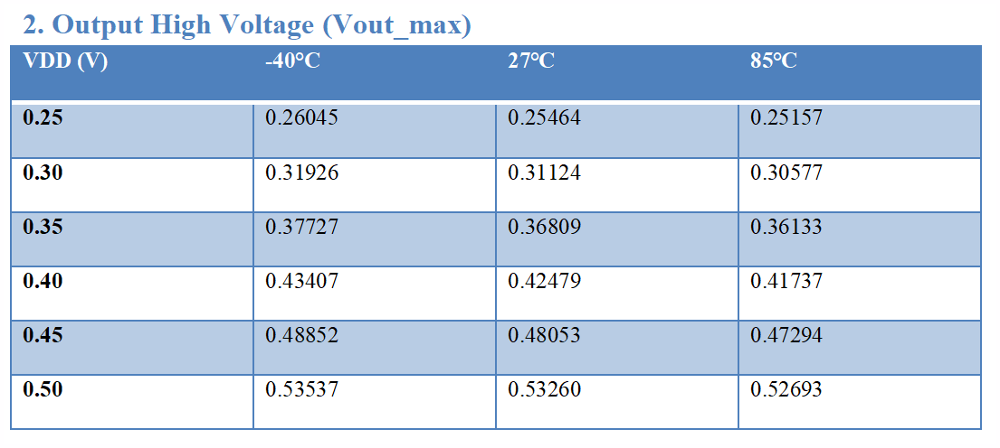
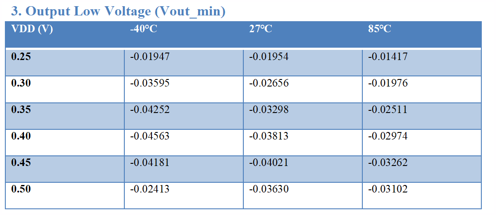
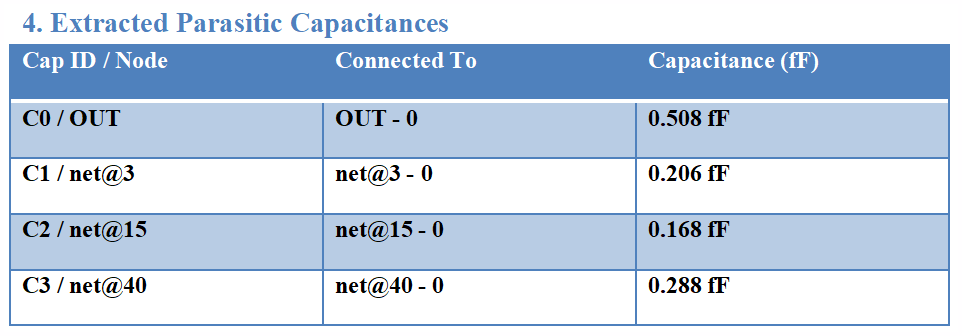
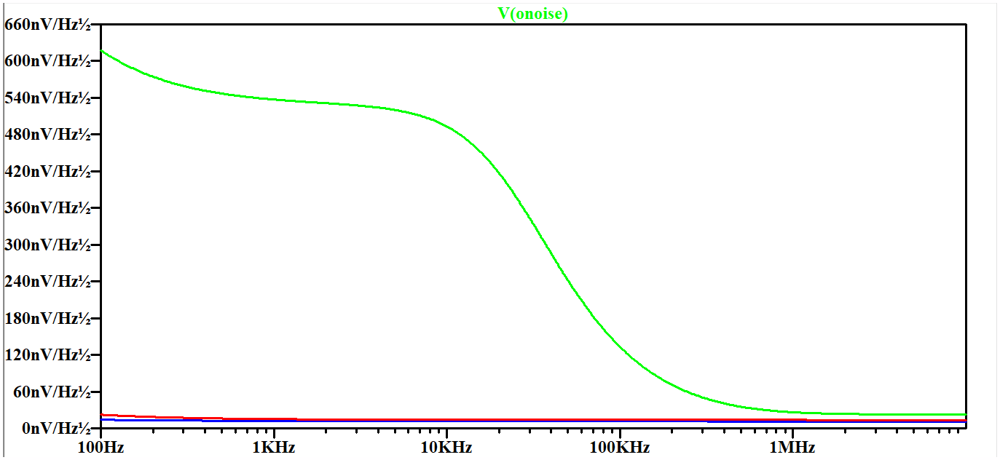

# Low-Power TSPC D Flip-Flop — 45 nm CMOS

Transistor-level design, full-custom layout, post-layout analysis, and PVT characterization of a low-power True Single Phase Clock (TSPC) D Flip-Flop in 45 nm CMOS.

## Overview

This project focuses on understanding the behavior of dynamic sequential logic under low-voltage operation and evaluating the trade-offs between power, timing, output swing, and reliability.

The TSPC D flip-flop was designed at the transistor level, followed by full-custom layout, parasitic extraction, post-layout simulation, and PVT characterization across supply voltage and temperature variations.

## Design Flow

The project follows a complete custom CMOS design flow:

1. **Transistor-Level Design**
   - Designed the TSPC D flip-flop using 45 nm CMOS device models.
   - Performed transient simulations in LTspice to verify clock-controlled data storage.
   - Evaluated operation across reduced supply voltages.

2. **Full-Custom Layout**
   - Implemented the circuit layout using Electric VLSI.
   - Applied CMOS design rules for device placement and routing.
   - Optimized power routing and sensitive dynamic nodes to reduce parasitic loading.

3. **Parasitic Extraction**
   - Extracted parasitic capacitances from the layout.
   - Incorporated extracted parasitics into post-layout simulations.
   - Evaluated their impact on timing and signal integrity.

4. **Post-Layout Analysis**
   - Compared functional behavior before and after parasitic extraction.
   - Analyzed clock-to-Q delay, output voltage swing, and transient behavior.

5. **PVT Characterization**
   - Supply voltage: **0.25 V – 0.5 V**
   - Temperature corners: **−40°C, 27°C, 85°C**
   - Characterized:
     - Clock-to-Q delay
     - Output voltage swing
     - Rise and fall time
     - Average power consumption

## Design Results

### Schematic

### Full-Custom Layout

### Functional Verification

The transient response was analyzed to verify the data-latching behavior of the TSPC flip-flop.

### Post-Layout Analysis

Post-layout simulation was used to evaluate the effect of extracted parasitic capacitances on circuit behavior.

## PVT Characterization

### Clock-to-Q Delay

Clock-to-Q delay was characterized across supply voltage and temperature corners. Delay increases significantly at very low supply voltage, particularly at elevated temperatures, due to reduced transistor drive strength.

### Output Voltage Swing

Output voltage swing was evaluated across the PVT range. Reduced supply voltage affects the ability of the dynamic circuit to achieve full logic levels, influencing noise margins and cascading reliability.

## Parasitic and Noise Analysis

### Extracted Parasitics

Post-layout extraction revealed additional capacitance at internal dynamic nodes, with the output node exhibiting approximately **0.508 fF** of parasitic capacitance.

These parasitics increase the effective switching load and contribute to timing degradation, particularly under near-threshold operation.

### Noise Analysis

The output noise spectrum was analyzed to understand the frequency-dependent noise behavior of the circuit.

The analysis considered:

- Low-frequency flicker noise
- Mid-frequency thermal noise
- High-frequency effects associated with clock feedthrough, charge injection, and parasitic filtering

Reduced supply voltage also decreases noise margins, increasing sensitivity to transient disturbances.

## Power–Delay Trade-off

Supply voltage scaling provides significant power reduction but introduces performance and reliability trade-offs.

Lower supply voltages result in:

- Reduced dynamic power
- Increased propagation delay
- Slower output transitions
- Reduced output swing
- Lower noise margins

The results indicate an operating region where power savings can be achieved without excessive degradation in timing and signal integrity.

## Key Observations

- Dynamic sequential circuits are highly sensitive to parasitic loading and supply voltage.
- Near-threshold operation can reduce power consumption but introduces significant timing and noise challenges.
- Layout parasitics become increasingly important as supply voltage is reduced.
- Careful transistor sizing, routing, and dynamic-node management are important for reliable TSPC operation.
- Full-custom post-layout analysis provides a more realistic assessment of circuit performance than schematic-level simulation alone.

## Tools & Technologies

- **LTspice** — transistor-level circuit simulation and analysis
- **Electric VLSI** — full-custom schematic/layout implementation and parasitic extraction
- **45 nm CMOS device models** — transistor-level design and characterization

## Project Files

The repository includes:

- LTspice/SPICE simulation files
- Electric VLSI library files
- PVT testbench
- CMOS schematic
- Full-custom layout
- Functional and post-layout waveforms
- Timing, output-swing, parasitic, and noise analysis results

## Future Improvements

Potential extensions include:

- Monte Carlo variability analysis
- Dynamic-node keeper optimization
- Further transistor sizing optimization
- Comparison with alternative sequential circuit architectures
- Integration into larger sequential logic blocks

## Project Context

**VLSI Design Project**  
45 nm CMOS  
Transistor-Level Design → Full-Custom Layout → Parasitic Extraction → Post-Layout Simulation → PVT Characterization
